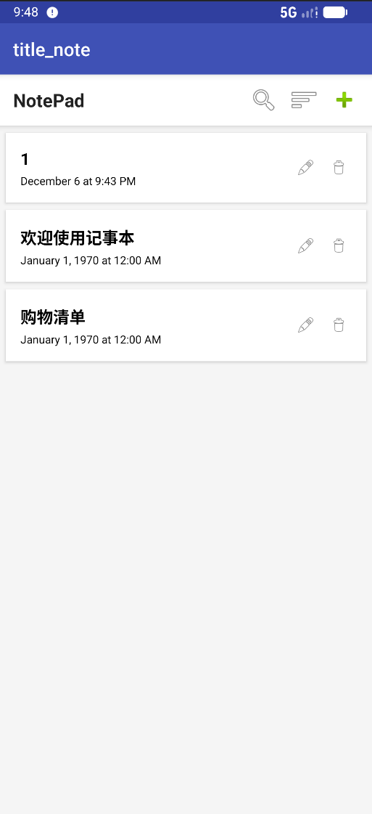
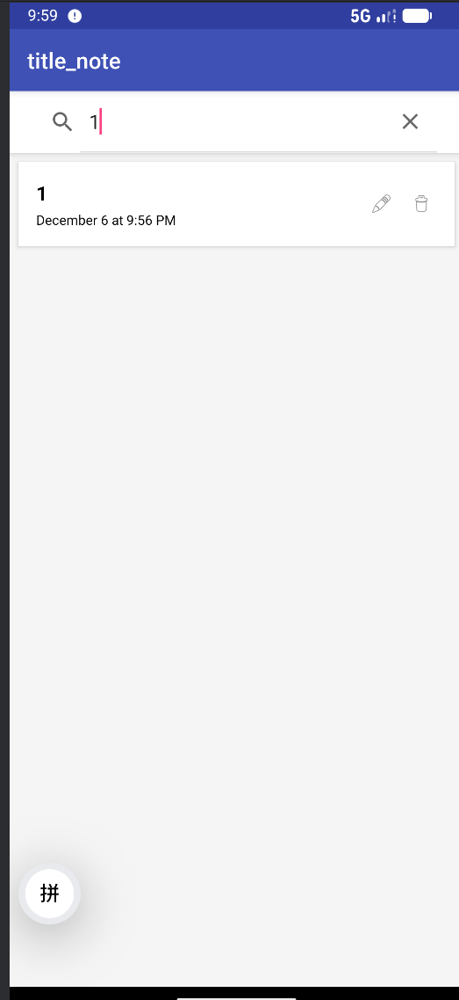
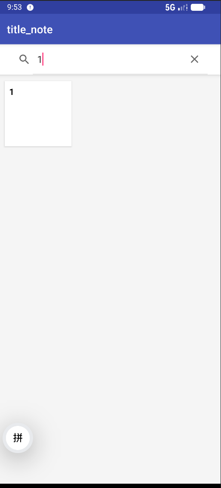
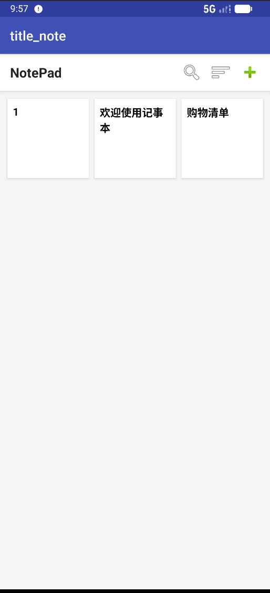
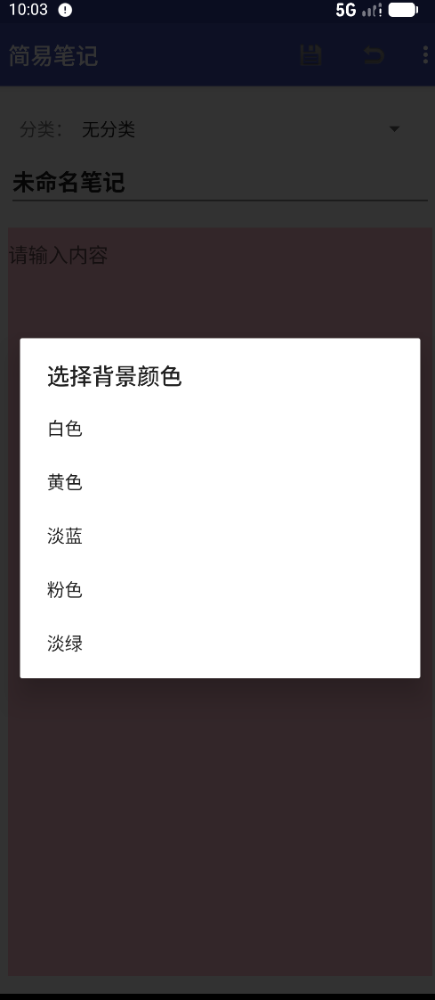

# Android NotePad 进阶开发 (期中实验项目)

## 实验概况 (Experiment Overview)

###  实验目标
本实验基于 Google Android SDK 提供的原始 `NotePad` 示例程序进行功能扩展和 UI 美化。原生的 NotePad 功能较为单一，仅具备基础的增删改查功能。本次期中实验旨在通过添加以下高级功能，提升应用的实用性和用户体验：

1.  **笔记搜索**：实现基于标题和内容的模糊查询。
2.  **时间戳显示**：在列表中显示笔记的最后修改时间。
3.  **UI 美化与背景更换**：实现笔记背景颜色的自定义（黄、蓝、绿、红、白），并持久化存储。
4.  **布局切换**：支持 ListView（列表）和 GridView（网格）的动态切换。
5.  **笔记导出**：支持将笔记内容导出为本地文件保存。
6.  **功能增强**：增加撤回功能、显式保存按钮等。

---

## 📱 功能展示 (Features & Screenshots)

### 1. 笔记列表与时间戳 (List View & TimeStamp)
在原有的笔记列表基础上，增加了**时间戳显示**，并优化了列表项的 UI 布局。

| 默认列表视图 |
| :---: |
|  |
| *每个笔记项右下角显示精确的修改时间，背景色根据笔记属性变化* |

### 2. 笔记搜索功能 (Note Search)
实现了全局搜索功能，支持模糊匹配笔记标题。搜索结果会动态更新列表。

| 列表模式搜索 | 网格模式搜索 |
| :---: | :---: |
|  |  |
| *在列表布局下搜索 "123"* | *在网格布局下搜索，支持实时过滤* |

### 3. 布局切换 (Layout Switch)
在菜单栏增加了切换按钮，允许用户在**线性列表**和**网格视图**之间自由切换，且应用会记住用户的选择。

| 网格视图 (Grid Layout) |
| :---: |
|  |
| *使用 GridLayoutManager 实现的 3 列网格布局* |

### 4. 笔记编辑与背景颜色 (Editor & Background Color)
在编辑界面，用户可以通过菜单更改笔记的背景颜色。颜色修改后会自动保存至数据库，并在列表页同步显示。

| 新建/编辑笔记 | 更改背景颜色 |
| :---: | :---: |
|  |  |
| *简洁的编辑界面* | *支持 白、黄、蓝、绿、粉 五种颜色切换* |

### 5. 笔记导出 (Note Export)
支持将当前笔记内容导出到手机 SD 卡存储中，方便用户备份。

| 导出功能 |
| :---: |
|  |
| *导出成功后的 Toast 提示及路径显示* |

---

## 🛠️ 关键技术实现 (Implementation Details)

### 1. 数据库扩展 (Database Extension)
为了支持背景颜色保存，修改了 `NotePadProvider` 和数据库契约类，增加了 `COLUMN_NAME_BACK_COLOR` 字段。
**原理**：通过 `SearchView` 监听输入，动态构建 SQL 的 `LIKE` 语句查询 `ContentProvider`。
```java
// NotesList.java - 动态查询逻辑
private void loadNotes(String keyword) {
    String selection = null;
    String[] args = null;
    if (!TextUtils.isEmpty(keyword)) {
        // 同时匹配 Title 和 Note 内容
        selection = NotePad.Notes.COLUMN_NAME_TITLE + " LIKE ? OR " + NotePad.Notes.COLUMN_NAME_NOTE + " LIKE ?";
        args = new String[]{"%" + keyword + "%", "%" + keyword + "%"};
    }
    Cursor cursor = getContentResolver().query(
            NotePad.Notes.CONTENT_URI, PROJECTION, selection, args, mSortOrder
    );
    mAdapter.swapCursor(cursor);
}

2. 布局动态切换 (Layout Switch)
原理：使用 SharedPreferences 持久化存储布局状态，根据状态切换 RecyclerView 的 LayoutManager。

Java

// NotesList.java
if (isGridLayout) {
    mRecyclerView.setLayoutManager(new GridLayoutManager(this, 3));
} else {
    mRecyclerView.setLayoutManager(new LinearLayoutManager(this));
}
// 切换适配器以应用不同的 XML 布局文件 (List item vs Grid item)
mAdapter = new NotesAdapter(isGridLayout);
mRecyclerView.setAdapter(mAdapter);
3. 背景换色与字体适配 (Color & UI)
原理：

数据库扩展字段 COLUMN_NAME_BACK_COLOR 存储颜色编码。
算法适配：计算背景颜色的灰度值，智能反转文字颜色（黑/白），防止文字看不清。
Java

// NotesList.java - 智能文字变色算法
private boolean isLightColor(int color) {
    int red = (color >> 16) & 0xFF;
    int green = (color >> 8) & 0xFF;
    int blue = color & 0xFF;
    // 灰度阈值判断
    return (0.299 * red + 0.587 * green + 0.114 * blue) > 128;
}

// 在 BindViewHolder 中应用
int textColor = isLightColor(realColor) ? Color.BLACK : Color.WHITE;
holder.title.setTextColor(textColor);
4. 笔记导出 (Export to TXT)
原理：利用 Java I/O 流将文本写入外部存储，涉及运行时权限处理。

Java

// NoteEditor.java
File sdCard = Environment.getExternalStorageDirectory();
File directory = new File(sdCard.getAbsolutePath() + "/NotePad");
File file = new File(directory, title + ".txt");

FileOutputStream fos = new FileOutputStream(file);
fos.write(content.getBytes());
fos.close();
5. 撤回功能 (Revert)
原理：在 Activity 启动时缓存原始文本，点击撤回时重置 EditText。

Java

// NoteEditor.java
private void revertNote() {
    if (mOriginalContent != null) {
        mText.setText(mOriginalContent); // 恢复缓存内容
        mText.setSelection(mOriginalContent.length());
    }
}
四、 数据库设计 (Database Schema)
为了支持背景颜色功能，修改了 NotePadProvider，在 notes 表中增加了 color 字段。

字段名	类型	描述
_id	INTEGER	主键
title	TEXT	笔记标题
note	TEXT	笔记内容
created	INTEGER	创建时间
modified	INTEGER	修改时间
color	INTEGER	新增：背景颜色编码